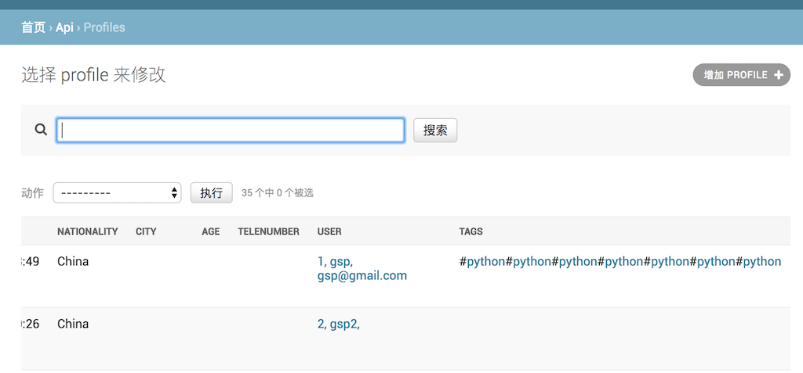
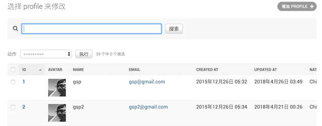
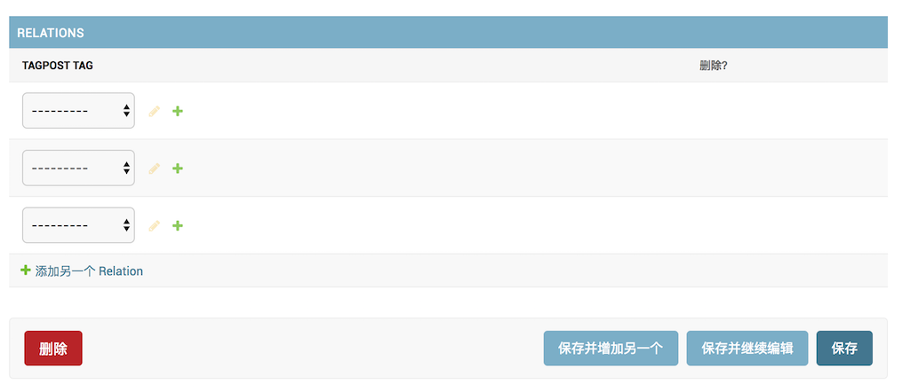

项目链接: [django admin](http://gongsongping.com/admin 'admin')  
试用登录username:test  登录pw:testuser   

>Python 3.6, Django 2.04  
pip install -r pip.txt  
python manage.py migrate  
python manage.py test api -k  
python manage.py runserver  

# Django admin 定制
  有人说Django的admin是花瓶, 不堪一用. 我觉得既然Django团队保留它,自然有它的好处. 一个小团队人手不够的时候, 几行代码就能拥有一个后台管理系统, 何乐而不为. 
  
  如果仅仅是只使用admin默认给你的东西, 自然是很简陋没法用的. admin提供了大量可定制的接口, 用好这些接口可以发挥出admin极大的潜力. 

  本项目是我定制的一些经验, 主要有以下看点, 以及遇到的坑:  
___

- ### _定义oneToOne的关系表并显示在对方的字段里, 显示字段要有link链接, 可以跳转到详细页面. 以User-Profile为例_

  admin默认提供了model User, 但是User只提供了少数字段,如 username, email, password等. 实际项目中, 我们需要更多的字段, 直接在User里加字段并不是明智的做法, 因为admin严重依赖User, 直接加字段会破坏这种依赖, 使得程序混乱,失控.  
   
  一种比较可行的做法是, 新建一个表Profile(也可叫其它名字), 然后和User建立oneToOne 一一对应关系.  
  代码实现:  
```python
#在models.py
from django.contrib.auth.models import User
from django.db.models.signals import post_save, post_delete
from django.dispatch import receiver

class Profile(models.Model):
    name = models.CharField(max_length=30, blank=True)
    email = models.CharField(max_length=30, blank=True)
    password_digest = models.CharField(max_length=300, blank=True)
    avatar = models.CharField(max_length=300, blank=True)
    created_at = models.DateTimeField(auto_now_add=True,null=True, blank=True)
    updated_at = models.DateTimeField(auto_now=True,null=True, 
    age = models.CharField(max_length=30, blank=True)

    user = models.OneToOneField(User, on_delete=models.CASCADE)

#在admin.py
from django.contrib import admin
from .models import *
from django.urls import reverse
from django.utils.safestring import mark_safe    
from django.utils.html import format_html
from django.contrib.auth.admin import UserAdmin
from django.contrib.auth.models import User

  class ProfileAdmin(admin.ModelAdmin):
    list_display = ('user_link',)

    def user_link(self, obj):
        return mark_safe('<a href="{}">{}</a>'.format(
            reverse("admin:auth_user_change", args=(obj.user.pk,)),
            str(obj.user.pk)+', '+obj.user.username+', '+ obj.user.email
        ))
    user_link.short_description = 'user'

admin.site.register(Profile, ProfileAdmin)
```
1. `user = models.OneToOneField(User, on_delete=models.CASCADE)`, 这就是和User建立一对一的方法, 它在Profile的对应表profiles里加入外键foreignKey `user_id`.
2. link链接到User的方法是`user_link`, 它在相应行插入`<a href="{}">{}</a>`, `reverse("admin:auth_user_change", args=(obj.user.pk,))` 会生成`/auth_user/:id`, `:id`就是外键`user_id`的值.

效果如下:  
  
点击`user`字段会跳转到对应`user`页

_______

- ### _照片显示, 以显示avatar头像为例_

  代码实现:
```python
from django.contrib import admin
from .models import *
from django.urls import reverse
from django.utils.safestring import mark_safe    
from django.utils.html import format_html
from django.contrib.auth.admin import UserAdmin
from django.contrib.auth.models import User

  class ProfileAdmin(admin.ModelAdmin):
    list_display = ('avatar_img',)

    def avatar_img(self, obj):
        return mark_safe(''.format(obj.avatar))
    avatar_img.short_description = 'avatar'

admin.site.register(Profile, ProfileAdmin)
```
1. 先继承admin.ModelAdmin , 然后定义一个`avatar_img`方法, 显示照片的html是``, 因为是插入到已有的html里面, 所以要用`mark_save`做escape, 也可以用`format_html`, 效果一样的.
2. 方法定义好以后, 要加入到list_display里面, 表示作为显示字段来显示.

 效果: 
     

______
- ### _在添加, 更改页面加入子页面, 以在`Post`里添加`Tag`为例_  
代码实现:  
```python
#models.py
class Post(models.Model):
    content = models.TextField(max_length=500)  
    profile = models.ForeignKey(Profile, on_delete=models.CASCADE, related_name='posts', blank=True, null=False)
    created_at = models.DateTimeField(auto_now_add=True,null=True, blank=True)
    updated_at = models.DateTimeField(auto_now=True,null=True, blank=True)

    class Meta:
        db_table = 'posts'
    
    @property
    def tagpost_tags(self):
        return [t.tagpost_tag for t in self.tagpost_tags_rs.all()]


class Tag(models.Model):
    name = models.CharField(max_length=200, null=True, blank=True) 
    created_at = models.DateTimeField(auto_now_add=True,null=True, blank=True)
    updated_at = models.DateTimeField(auto_now=True,null=True, blank=True)       

    @property
    def tagprofile_profiles(self):
        return [t.tagprofile_profile for t in self.tagprofile_profiles_rs.all()] 

    @property
    def tagpost_posts(self):
        return [t.tagpost_post for t in self.tagpost_posts_rs.all()]    

    class Meta:
        db_table = 'tags'


class Relation(models.Model):
    created_at = models.DateTimeField(auto_now_add=True,null=True, blank=True)
    updated_at = models.DateTimeField(auto_now=True,null=True, blank=True)       
    #tag-post relation
    tagpost_post = models.ForeignKey(Post, on_delete=models.CASCADE, related_name="tagpost_tags_rs", default=1)
    tagpost_tag = models.ForeignKey(Tag, on_delete=models.CASCADE, related_name="tagpost_posts_rs", default=1)

    class Meta:
        db_table = 'relations'

#admin.py
class Tagpost_tags(admin.TabularInline):
    model = Relation
    fk_name = "tagpost_post"
    fields = ['tagpost_tag','tagpost_post']
    def formfield_for_foreignkey(self, db_field, request, **kwargs):
        kwargs['initial'] = None
        return super(Tagpost_tags,self).formfield_for_foreignkey(
            db_field, request, **kwargs
        )

class PostAdmin(admin.ModelAdmin):
    inlines = [Tagpost_tags]

admin.site.register(Post, PostAdmin)

```
1. `Post`和`Tag`是多对多关系, 需要一个中间表`Relation`
2. `Tagpost_tags`需要继承`admin.TabularInline`
2. `inlines = [Tagpost_tags]`, 表示在添加页和修改页显示`Tag`  

 效果: 
   